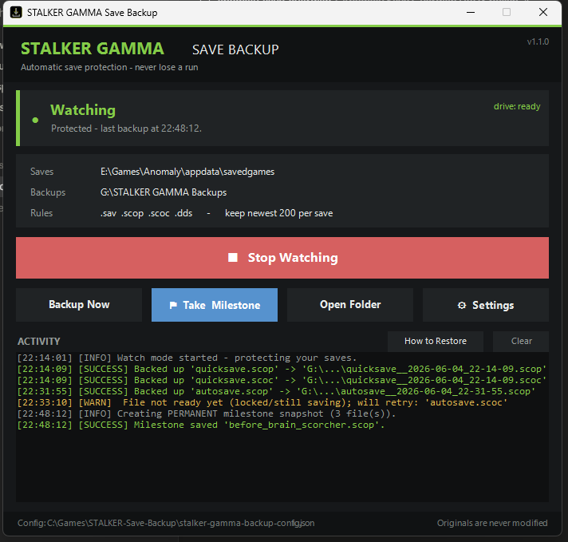

# STALKER GAMMA Save Backup

A small, dependency-free **Windows** app that automatically backs up your
**S.T.A.L.K.E.R. GAMMA / Anomaly** save files. It watches your save folder and
copies every new or changed save the moment it appears — so a bad death, a
crash, or a corrupt save never costs you a run.

Built entirely on **built-in PowerShell / .NET** — nothing to install.



> **🛡️ Safe by design:** your original saves are only ever *read and copied* —
> never modified, renamed, moved, or deleted. The only files the tool ever
> deletes are *old backup copies* in the backup folder (retention), and
> milestone snapshots are never deleted at all.

---

## Features

- 🟢 **Auto-watch** — backs up every save the moment it appears as you play.
- 🚦 **Clear status at a glance** — *Idle*, *Watching*, *Waiting for backup
  drive*, *Backing up*, or *Needs attention*, with a colour-coded indicator.
- 🏁 **Milestone snapshots** — permanent, never-deleted backups for hardcore /
  Invictus runs.
- 🧭 **Guided first run** — a friendly welcome walks new users through setup; no
  JSON editing required.
- 🧰 **In-app Settings** — grouped, with folder pickers, helper text, validation
  and a *Reset to defaults* button.
- 🛟 **Built-in "How to Restore" guide** — step-by-step, right inside the app.
- 🗂️ **Timestamped, append-only** backups — a death can never overwrite an
  older backup.
- ♻️ **Retention** — keep the newest *N* backups per save; old ones pruned
  safely (milestones exempt).
- 🗜️ **Optional `.zip`** backups.
- 📌 **System tray** — minimise/close to tray, keeps running in the background.
- 💪 **Robust** — handles locked/partly-written saves and an unplugged backup
  drive without ever crashing.

---

## Requirements

- Windows 10 / 11
- Windows PowerShell 5.1 (built in) — or PowerShell 7+
- A backup destination (a **second drive is strongly recommended**)

---

## Quick start

1. **Get the files** into one folder (anywhere):
   - **Easiest:** download the latest release `.zip` from the
     [Releases page](https://github.com/PabloBratee/anomaly-save-guardian/releases)
     and extract it, **or**
   - clone the repo:
     ```
     git clone https://github.com/PabloBratee/anomaly-save-guardian.git
     ```
   The folder must contain at least:
   - `backup-stalker-gamma-saves.ps1`
   - `stalker-gamma-backup-ui.ps1`
   - `stalker-gamma-backup-config.example.json`
   - `stalker-gamma-backup.ico`
2. **Run** `stalker-gamma-backup-ui.ps1` (double-click, or make a shortcut —
   see below). On first run it creates your personal
   `stalker-gamma-backup-config.json` and shows a short **welcome** that walks
   you through setup.
3. In **Settings**, point **Save folder** and **Backup folder** at the right
   places, then **Save**.
4. Click **Start Watching** and minimise. Done — every save is now backed up.

> If Windows blocks the script, launch it once with:
> ```
> powershell -ExecutionPolicy Bypass -File .\stalker-gamma-backup-ui.ps1
> ```
> See [Troubleshooting](#troubleshooting).

### Create a desktop shortcut

Right-click your Desktop → **New → Shortcut**, and use:

```
powershell.exe -NoProfile -ExecutionPolicy Bypass -WindowStyle Hidden -File "FULL\PATH\TO\stalker-gamma-backup-ui.ps1"
```

Replace `FULL\PATH\TO` with the folder you saved the files in (keep the quotes —
they matter if the path has spaces). Set the icon to `stalker-gamma-backup.ico`
via the shortcut's **Properties → Change Icon**.

---

## Recommended setup (GAMMA players)

- **Save folder** — your GAMMA/Anomaly `appdata\savedgames` folder.
  - GAMMA via the launcher: usually `...\GAMMA\Anomaly\appdata\savedgames`.
  - Standalone Anomaly: `...\Anomaly\appdata\savedgames`.
  - Not sure? Make an in-game save, then search your Anomaly folder for a
    `*.scop` file — that folder is your save folder.
- **Backup folder** — put it on a **different physical drive** from the game.
  A backup on the same disk won't help if that disk dies.
- **Keep the defaults** (`.sav .scop .scoc .dds`, keep 200) unless you have a
  reason to change them. `.scop` + `.scoc` together are a full save.
- Before anything risky (a tough fight, the Brain Scorcher, a long-run hardcore
  character), hit **Take Milestone** — it's a permanent snapshot that retention
  never deletes.

---

## Using the app

| Control | What it does |
|---|---|
| **Start / Stop Watching** | Toggles automatic backups (green = idle, red = watching). |
| **Backup Now** | Backs up all current saves once, immediately. |
| **Take Milestone** | Permanent snapshot of all current saves — never auto-deleted. |
| **Open Folder** | Opens the backup folder in Explorer. |
| **Settings** | Change folders, file types, retention, delay, zip mode. No JSON editing. |
| **How to Restore** | Opens a step-by-step guide for putting a save back. |
| **Clear** | Clears the on-screen activity log (touches no files). |

Hover any button for a tooltip explaining what it does.

**Status indicator** (top card): tells you exactly what the app is doing —
whether it's actively protecting your saves, idle, waiting for the backup drive,
or needs attention.

**System tray:** the **minimize** button and the **X** both send the window to
the tray (it keeps running and backing up). **Double-click** the tray icon to
reopen it; **right-click** for a quick menu. The only way to fully quit is tray →
**Exit**.

> Make sure the backup drive is connected before watching. If it isn't, the
> status shows *“Waiting for backup drive…”* and resumes automatically once it's
> back.

---

## Configuration

Use **Settings** in the app (recommended), or edit
`stalker-gamma-backup-config.json` directly:

```json
{
  "saveFolderPath": "C:\\Anomaly\\appdata\\savedgames",
  "backupFolderPath": "D:\\STALKER GAMMA Backups",
  "milestoneFolderPath": "D:\\STALKER GAMMA Backups\\Milestones",
  "includeExtensions": [".sav", ".scop", ".scoc", ".dds"],
  "backupDelaySeconds": 3,
  "keepMaxBackupsPerSave": 200,
  "enableZipBackup": false,
  "logFilePath": "D:\\STALKER GAMMA Backups\\backup-log.txt"
}
```

| Setting | Meaning |
|---|---|
| `saveFolderPath` | Your GAMMA/Anomaly `appdata\savedgames` folder (source). |
| `backupFolderPath` | Where rolling backups are written. |
| `milestoneFolderPath` | Permanent snapshots — retention **never** deletes these. Optional; defaults to a `Milestones` subfolder of the backup folder. |
| `includeExtensions` | File types to back up. `.scop` + `.scoc` are a full save; `.dds` is the thumbnail. |
| `backupDelaySeconds` | Settle time after a change before copying. |
| `keepMaxBackupsPerSave` | How many rolling backups to keep per save name. Milestones are exempt. |
| `enableZipBackup` | `true` = store each backup as a `.zip`; `false` = plain copy (easiest to restore). |
| `logFilePath` | Where the log is written. |

In raw JSON, Windows paths need **doubled** backslashes (`\\`). The Settings
dialog handles this for you.

---

## Hardcore / Invictus runs: will a death overwrite my backups?

**No.** Each backup is a separate, timestamped file. When you die, the game
overwrites only your *live* save; the tool then writes the dead state as a **new**
backup and leaves every earlier "alive" backup untouched.

To protect a specific point against retention pruning, **Take Milestone** — those
snapshots live in the milestone folder and are never auto-deleted, surviving any
number of deaths and saves. Naming a distinct in-game hard-save also gives it its
own retention bucket.

---

## Restoring a save

The app has a built-in **How to Restore** button that walks you through this.
The short version:

1. **Close the game.**
2. Open your backup folder (or the `Milestones` subfolder).
3. Pick the backup you want. A full save is the **`.scop` + `.scoc` pair** with
   the same timestamp — restore **both** (the `.dds` thumbnail is optional). If
   it's a `.zip`, extract it first.
4. Copy the file(s) into your save folder.
5. Remove the `__YYYY-MM-DD_HH-mm-ss` part from each name, e.g.
   `quicksave__2026-06-04_22-30-15.scop` → `quicksave.scop`.
6. Launch the game and load it.

Copying into your save folder does **not** affect your backups — they stay
exactly where they are.

---

## Command-line usage (optional)

The engine works without the GUI:

```powershell
.\backup-stalker-gamma-saves.ps1 -BackupNow            # one-time backup
.\backup-stalker-gamma-saves.ps1 -Watch                # watch continuously (Ctrl+C to stop)
.\backup-stalker-gamma-saves.ps1 -Milestone            # permanent snapshot
.\backup-stalker-gamma-saves.ps1 -BackupNow -DryRun    # preview, touches nothing
.\backup-stalker-gamma-saves.ps1 -Watch -DryRun        # preview events live
```

Backups are named `OriginalSaveName__YYYY-MM-DD_HH-mm-ss.ext`
(e.g. `quicksave__2026-06-04_22-30-15.scop`).

---

## How it works

- The GUI polls the save folder every ~2 seconds; the CLI `-Watch` uses an
  event-driven `FileSystemWatcher`. Both back up only when a file's
  size + last-write-time actually changes (in-memory de-duplication).
- Before copying, a file must be size-stable and not locked; locked files are
  retried and otherwise skipped (and retried later) — nothing ever crashes the
  run.
- Retention keeps the newest *N* backups per save name (sorted by the timestamp
  in the filename, which is reliable even though copies share the source's
  modified time). The milestone folder is never scanned by retention.

---

## Troubleshooting

**“…cannot be loaded because running scripts is disabled” / Windows blocks it.**
Windows' execution policy is stopping the script. Launch it once with a bypass
for that single run (this does not change your system policy):
```
powershell -NoProfile -ExecutionPolicy Bypass -File .\stalker-gamma-backup-ui.ps1
```
The desktop-shortcut command above does this for you automatically.

**The app “closed” but is still running.** That's intended — the **X** and the
minimize button send it to the **system tray**, so it keeps backing up.
Double-click the tray icon to reopen it, or right-click → **Exit** to quit fully.

**Status says “Waiting for backup drive”.** The drive holding your backup folder
isn't connected. Plug it in — watching resumes and backs up automatically. You
don't need to restart the app.

**“Save folder not found” when I click Start Watching.** Your **Save folder**
isn't set correctly. Open **Settings** and point it at your Anomaly/GAMMA
`appdata\savedgames` folder. Tip: make an in-game save, then search your Anomaly
folder for a `*.scop` file — that folder is the one you want.

**No backups are appearing.**
- Are you **Watching** (button is red / status is green “Watching”)?
- Is the **backup drive connected** (status not “Waiting for backup drive”)?
- Do your saves match the **file types** in Settings (`.scop .scoc` etc.)?
- Check the **Activity log** in the app, or the log file, for errors.
- Try **Backup Now** for an immediate one-off pass.

**I need to load an old save.** Click **How to Restore** in the app, or see
[Restoring a save](#restoring-a-save) above. Always close the game first and
restore the matching `.scop` + `.scoc` pair together.

**My save and backup folders are the same / on the same disk.** Use two
*different* folders, ideally on two *different* drives. The Settings dialog warns
you if they're identical, and a backup on the same physical disk won't survive
that disk failing.

---

## Safety

This tool is built to be trustworthy with your saves:

- **Originals are read-only to the tool.** Saves are only ever opened for reading
  and copied out. They are never modified, renamed, moved, or deleted.
- **Deletions are scoped and conservative.** Retention only deletes *backup
  copies* it created, and only those physically inside the backup folder.
  Milestone snapshots are never deleted.
- **No network, no telemetry, no dependencies.** Everything runs locally with
  built-in Windows components.
- **Your personal config and logs stay local** and are git-ignored.

See [SECURITY.md](SECURITY.md) for the full safety model and how to report
issues.

---

## Releases

Want to publish or grab a clean download?

- **For users:** download the latest `.zip` from the
  [Releases page](https://github.com/PabloBratee/anomaly-save-guardian/releases),
  extract it anywhere, and follow [Quick start](#quick-start).
- **For maintainers:** build a clean release package (only the files users need —
  never your personal config, logs, or backups):
  ```powershell
  .\scripts\package-release.ps1
  ```
  This creates `dist\STALKER-GAMMA-Save-Backup-vX.Y.Z.zip` and prints the exact
  steps to tag and publish a GitHub Release. The `dist\` folder is git-ignored.

---

## Project layout

```
backup-stalker-gamma-saves.ps1          # backup engine + CLI (also a library)
stalker-gamma-backup-ui.ps1             # the GUI app
stalker-gamma-backup-config.example.json# template (committed)
stalker-gamma-backup-config.json        # your personal config (git-ignored)
stalker-gamma-backup.ico                # app/tray icon
scripts/check-syntax.ps1                # parse-check all .ps1 files
scripts/package-release.ps1             # build a clean release .zip
README.md  CHANGELOG.md  LICENSE  SECURITY.md  CONTRIBUTING.md  .gitignore
```

> Publishing your own copy? Don't run `git init` inside your `savedgames` folder.
> Copy the program files into a separate folder first — the included `.gitignore`
> already excludes saves, your personal config, and logs.

---

## Contributing

Issues and PRs are welcome. Please keep the tool simple, dependency-free, and
safe. See [CONTRIBUTING.md](CONTRIBUTING.md).

## License

[MIT](LICENSE) © 2026 PabloBratee
